# Language Server for Java using the [Java Compiler API](https://docs.oracle.com/javase/7/docs/api/javax/tools/JavaCompiler.html)

Provides Java support using the Java Compiler API.
Requires that you have Java 8 installed on your system.

## Installation

[Install from the VS Code marketplace](https://marketplace.visualstudio.com/items?itemName=georgewfraser.vscode-javac)

## [Issues](https://github.com/georgewfraser/vscode-javac/issues)

## Features

### Javadoc

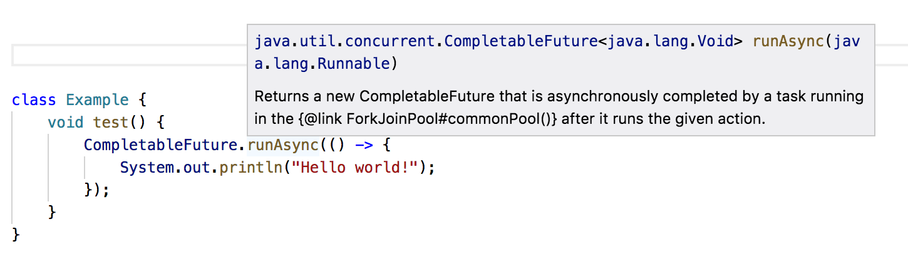

### Signature help

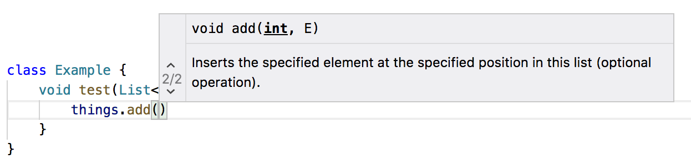

### Autocomplete symbols (with auto-import)

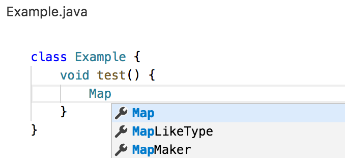

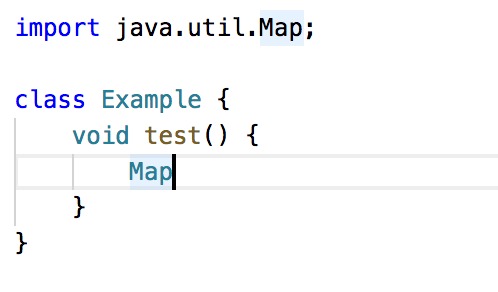

### Autocomplete members

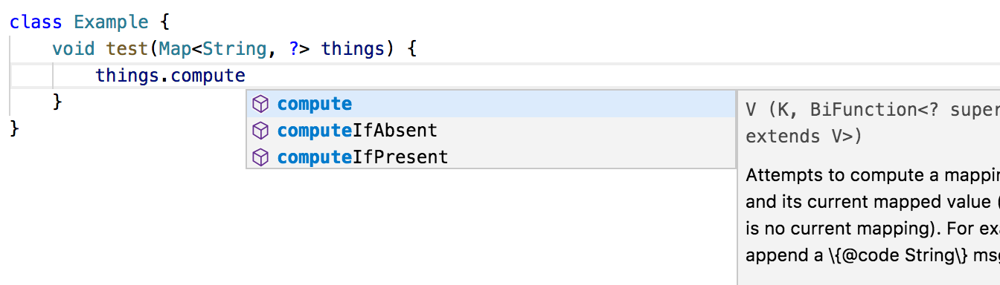

### Go-to-definition


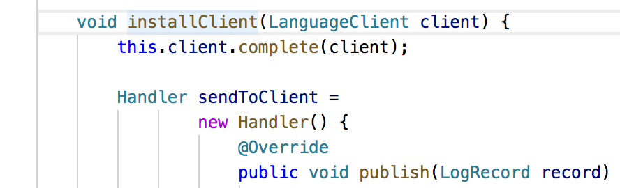

### Find symbols


### Lint

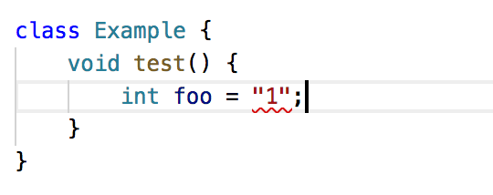

### Type information on hover

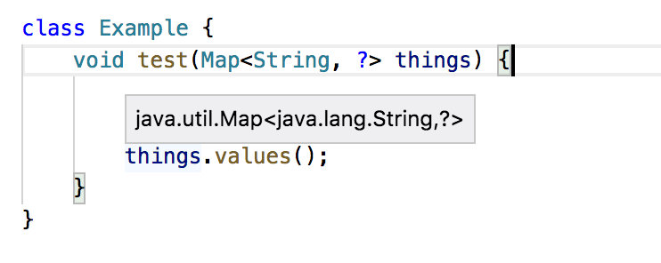

### Code actions

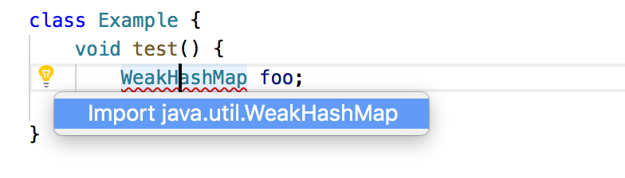

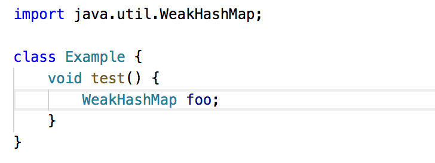

### Find references

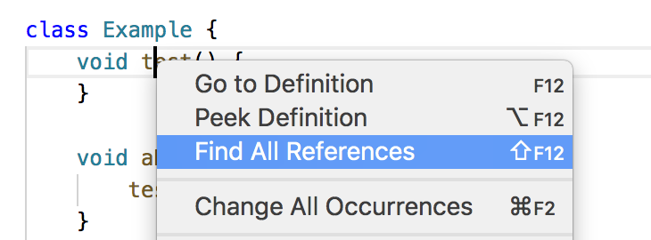

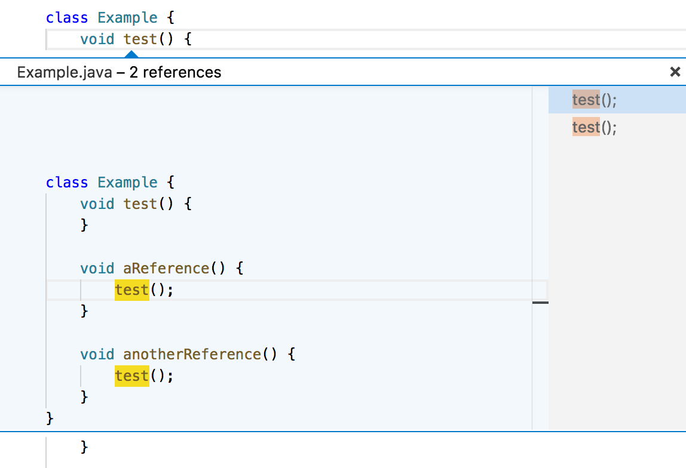

## Usage

VSCode will provide autocomplete and help text using:
* .java files anywhere in your workspace
* Java platform classes
* External dependencies specified using `pom.xml`, Bazel, or [settings](#Settings)

## Settings

If VSCode doesn't detect your external dependencies automatically, 
you can specify your external dependencies using [.vscode/settings.json](https://code.visualstudio.com/docs/getstarted/settings)

```json
{
    "java.externalDependencies": [
        "junit:junit:jar:4.12:test", // Maven format
        "junit:junit:4.12" // Gradle-style format is also allowed
    ]
}
```

If all else fails, you can specify the java class path manually:

```json
{
    "java.classPath": [
        "lib/some-dependency.jar"
    ]
}
```

You can generate a list of external dependencies using your build tool:
* Maven: `mvn dependency:list` 
* Gradle: `gradle dependencies`

The Java language server will look for the dependencies you specify in `java.externalDependencies` in your Maven and Gradle caches `~/.m2` and `~/.gradle`.
You should use your build tool to download the library *and* source jars of all your dependencies so that the Java language server can find them:
* Maven
  * `mvn dependency:resolve` for compilation and autocomplete
  * `mvn dependency:resolve -Dclassifier=sources` for inline Javadoc help
* Gradle
  * `gradle dependencies` for compilation and autocomplete
  * Include `classifier: sources` in your build.gradle for inline Javadoc help, for example:
    ```
    dependencies {
        testCompile group: 'junit', name: 'junit', version: '4.+'
        testCompile group: 'junit', name: 'junit', version: '4.+', classifier: 'sources'
    }
    ```
    
## Design

This extension consists of an external java process, 
which communicates with vscode using the [language server protocol](https://github.com/Microsoft/vscode-languageserver-protocol). 

### Java service process

The java service process uses the standard implementation of the Java compiler.
When VS Code needs to lint a file, perform autocomplete, 
or some other task that requires Java code insight,
the java service process invokes the Java compiler programatically,
then intercepts the data structures the Java compiler uses to represent source trees and types.

### Incremental updates

The Java compiler isn't designed for incremental parsing and analysis.
However, it is *extremely* fast, so recompiling a single file gives good performance,
as long as we don't also recompile all of its dependencies.

## Logs

The java service process will output a log file to stdout, which is visible using View / Output.

## Contributing

If you have npm and maven installed,
you should be able to install locally using 

    npm install -g vsce
    npm install
    ./scripts/install.sh